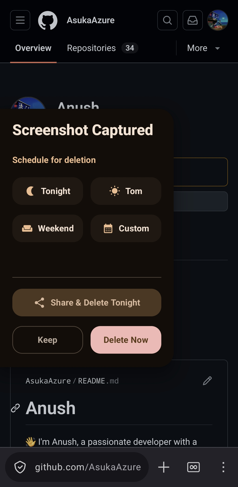
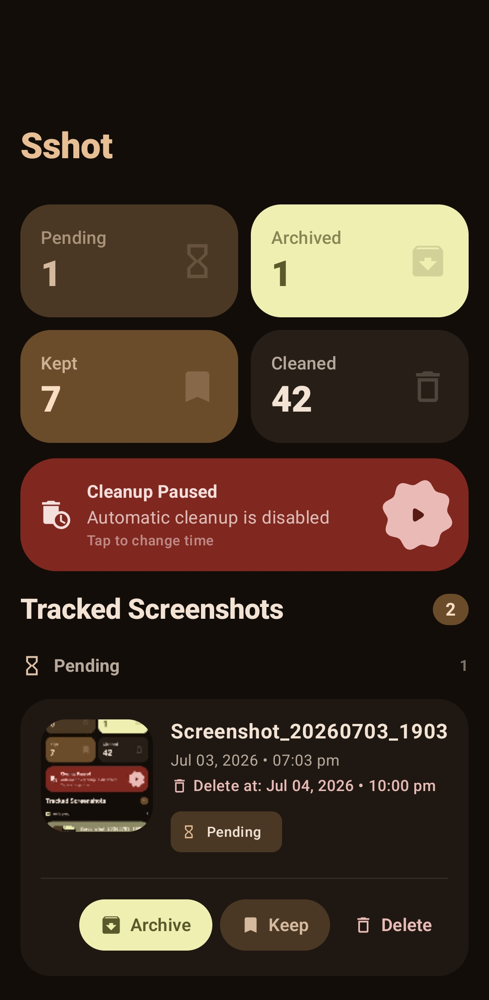

<div align="center">
  
  <h1>Sshot</h1>
  <p>Minimal Android 14+ screenshot management utility</p>
  <p>
    <strong>Kotlin</strong> · <strong>Jetpack Compose</strong> · <strong>Material 3</strong>
  </p>
  <p>
    Forked project from <a href="https://github.com/ShubhamJ010/ScreenshotJanitor">ShubhamJ010/ScreenshotJanitor</a>
  </p>
  <p>
    <a href="#install">Install</a> ·
    <a href="#features">Features</a> ·
    <a href="#tech-stack">Tech Stack</a> ·
    <a href="#getting-started">Getting Started</a> ·
    <a href="#permissions">Permissions</a> ·
    <a href="docs/architecture.md">Architecture</a>
  </p>
</div>

---
## Sshot has an overlay that pops up after a screenshot, letting you set a custom timer to delete it.

Sshot monitors newly created screenshots, lets you archive or delete them through lightweight notifications, and automatically cleans up unarchived screenshots on a schedule. Intentionally lightweight, battery-friendly, and aligned with modern Android storage and background execution policies.

## Install

[](https://github.com/asukaAzure/Sshot/releases/latest)
[](LICENSE)

## Screenshots

<table>
  <tr>
    <td></td>
    <td></td>
  </tr>
</table>

## Features

- **Screenshot Detection** — URI-based detection via MediaStore ContentObserver with cold-start initial scan, exponential-backoff retry, `IS_PENDING` column filtering, and fallback scan for edge cases.
- **Action Notifications** — Archive, Keep, or Delete from a dismissible notification.
- **Auto-Archive Mode** — Long-press the Archived card to auto-archive every new screenshot by default.
- **Battery Optimization Opt-Out** — Dedicated card with one-tap "Battery Usage" button to disable battery optimization.
- **Automatic Cleanup** — WorkManager-based daily cleanup removes archived screenshots.

[Detailed feature docs →](docs/features.md)

## Tech Stack

| Layer | Technology |
|---|---|
| Language | Kotlin |
| UI | Jetpack Compose + Material 3 Expressive |
| Local Database | Room |
| Background Tasks | WorkManager |
| Storage APIs | MediaStore |
| Notifications | NotificationCompat |
| Architecture | MVVM-lite |

## Getting Started

1. Open the project in Android Studio.
2. Sync Gradle (uses version catalog at `gradle/libs.versions.toml`).
3. Build and run on a device running **Android 14+** (min SDK 34).

No API keys, no cloud services, no configuration required.

## Building from Source

```bash
# Clone the repository
git clone https://github.com/ShubhamJ010/ScreenshotJanitor.git
cd ScreenshotJanitor

# Build debug APK
./gradlew assembleDebug

# Build release APK
./gradlew assembleRelease

# Run unit tests
./gradlew test

# Run lint checks
./gradlew lint
```

## Permissions

```xml
<uses-permission android:name="android.permission.READ_MEDIA_IMAGES" />
<uses-permission android:name="android.permission.POST_NOTIFICATIONS" />
<uses-permission android:name="android.permission.MANAGE_EXTERNAL_STORAGE" />
<uses-permission android:name="android.permission.REQUEST_IGNORE_BATTERY_OPTIMIZATIONS" />
```

- `READ_MEDIA_IMAGES` — Required to query screenshots from MediaStore.
- `POST_NOTIFICATIONS` — Required for screenshot action notifications.
- `MANAGE_EXTERNAL_STORAGE` — Required for batch deletion of archived screenshots.
- `REQUEST_IGNORE_BATTERY_OPTIMIZATIONS` — Required to opt out of battery optimization for reliable background detection.

## Project Structure

```
app/src/main/java/dev/sj010/ssjanitor/
├── core/              — Constants, extensions, utils
├── data/              — Room DB, DAO, entities, repositories
├── notifications/     — Notification manager & action receiver
├── observer/          — ContentObserver & screenshot detection
├── ui/                — Compose screens, components, theme
├── viewmodel/         — ViewModels
├── worker/            — WorkManager cleanup worker
├── MainActivity.kt
└── SsJanitorApp.kt
```

## Documentation

| Document | Description |
|---|---|
| [Architecture](docs/architecture.md) | MVVM layers, process flows, component details |
| [Features](docs/features.md) | Detailed feature descriptions |
| [Database Schema](docs/database.md) | Room entities, DAO, repository |
| [Notifications](docs/notifications.md) | Notification flow & action handling |
| [Cleanup Worker](docs/cleanup.md) | WorkManager-based cleanup pipeline |
| [Resource Usage](docs/resource-usage.md) | Foreground / background CPU, memory, and battery profiling |
| [Development](docs/development.md) | Principles, design goals, MVP scope, future ideas |
| [Release Signing](docs/RELEASE_SIGNING.md) | Keystore setup, CI signing, troubleshooting |
| [Changelog](CHANGELOG.md) | Release history |

## License

[MIT](LICENSE)

## Contributing

Contributions are welcome! Please feel free to submit a Pull Request. For major changes, please open an issue first to discuss what you would like to change.
